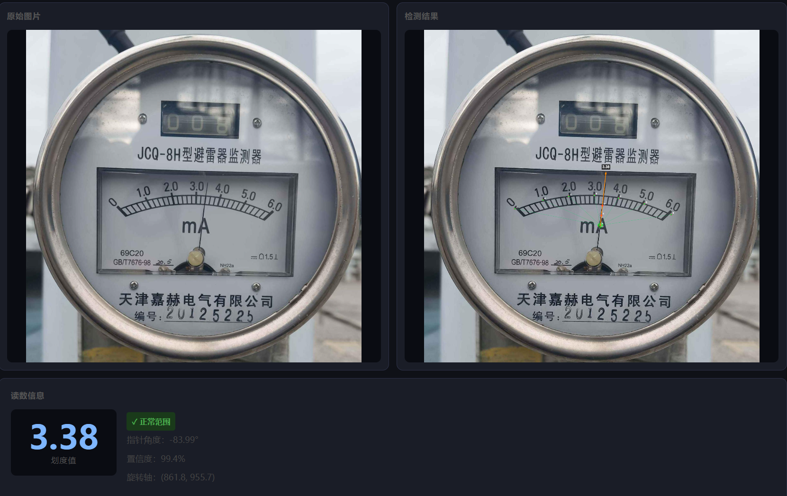

# meter-vision 项目学习文档

[中文] | [English](https://github.com/your-username/meter-vision)

> 本文档详细记录了 meter-vision 指针仪表读数识别项目的完整学习过程，包括算法原理、数学推导、库的使用方法、实现方案演进以及期间踩过的坑和解决方案。
>
> 适合读者：对计算机视觉、YOLO 姿态估计、FastAPI 前后端开发有兴趣的开发者。

---

## 目录

1. [项目概述](#1-项目概述)
2. [算法基础与数学原理](#2-算法基础与数学原理)
3. [YOLO Pose 关键点检测](#3-yolo-pose-关键点检测)
4. [核心库使用方法](#4-核心库使用方法)
5. [后端设计与实现](#5-后端设计与实现)
6. [前端设计与实现](#6-前端设计与实现)
7. [问题与解决方案记录](#7-问题与解决方案记录)
8. [部署与使用指南](#8-部署与使用指南)
9. [扩展与改进方向](#9-扩展与改进方向)
10. [工具链与周边知识](#10-工具链与周边知识)
附录 A：[术语表](#附录-a术语表)
附录 B：[关键公式速查](#附录-b关键公式速查)

---

## 1. 项目概述

### 1.1 项目目标

在变电站巡检场景中，存在大量模拟指针仪表（压力表、电压表、电流表等），需要自动读取其示数。传统方案依赖人工抄表或专用仪表识别设备，成本高且效率低。

**meter-vision** 的目标是：**用一张照片（或视频流），自动识别仪表关键点，计算出当前读数**。



### 1.2 技术方案

```
                  ┌─────────────┐    ┌──────────────┐    ┌────────────┐
  图片/视频帧 ──▶ │ YOLO Pose   │──▶│ gauge_reader │──▶│  读数输出   │
                  │ 关键点检测   │    │ 角度→读数算法 │    │            │
                  └─────────────┘    └──────────────┘    └────────────┘
```

- **YOLO Pose** 负责在仪表盘上检测 10 个关键点（指针 3 个 + 刻度 7 个）
- **gauge_reader** 负责从关键点坐标计算具体读数
- **FastAPI 后端** 暴露 HTTP API，支持图片和视频流
- **前端** 提供拖拽上传和实时视频流预览

### 1.3 关键点约定

| kp_id | 位置 | 对应刻度值 |
|-------|------|-----------|
| 0 | 指针底部（旋转轴） | — |
| 1 | 指针中部 | — |
| 2 | 指针末端 | — |
| 3 | 刻度标记 | 0.0 |
| 4 | 刻度标记 | 1.0 |
| 5 | 刻度标记 | 2.0 |
| 6 | 刻度标记 | 3.0 |
| 7 | 刻度标记 | 4.0 |
| 8 | 刻度标记 | 5.0 |
| 9 | 刻度标记 | 6.0 |

```
                         kp6●
                  kp5●  (3,0)   kp7●
           kp4●  (2,0)          (4,0)  kp8●
    kp3●  (1,0)                        (5,0) kp9●   
   (0,0)                kp2 ●                (6,0)
                        kp1 ●
                        kp0 ●
```

---

## 2. 算法基础与数学原理

### 2.1 核心思想：角度—刻度的映射

仪表读数的本质是**指针臂相对于表盘刻度弧的角度位置**。

如果我们能知道：
- 指针指向哪个角度：`θ_ptr`
- 刻度的每个标记在什么角度：`θ_3, θ_4, θ_5, θ_6, θ_7, θ_8, θ_9`

那么就可以用插值得到读数：

> `value = interp(θ_ptr, [θ_3, θ_4, ..., θ_9], [0.0, 1.0, ..., 6.0])`

### 2.2 旋转轴的确定（关键设计决策）

这是整个算法最核心的设计决策。我们经历了两个版本的演进：

#### v1（被否决）：最小二乘圆拟合

**思路**：对 kp3~kp9 这 7 个刻度点做圆拟合，取拟合圆的圆心作为旋转轴。

**数学**：

圆的方程：

$$x^2 + y^2 = Dx + Ey + F$$

写成矩阵形式：

$$A \begin{bmatrix} D \\ E \\ F \end{bmatrix} = \mathbf{b}$$

其中：

$$A = \begin{bmatrix} x_1 & y_1 & 1 \\ x_2 & y_2 & 1 \\ \vdots & \vdots & \vdots \\ x_n & y_n & 1 \end{bmatrix}, \quad
\mathbf{b} = \begin{bmatrix} x_1^2 + y_1^2 \\ x_2^2 + y_2^2 \\ \vdots \\ x_n^2 + y_n^2 \end{bmatrix}$$

用 `np.linalg.lstsq` 解最小二乘得到 D, E, F，然后：

$$c_x = \frac{D}{2}, \quad c_y = \frac{E}{2}, \quad r = \sqrt{c_x^2 + c_y^2 + F}$$

**问题**：拍摄仪表盘时总是存在**透视投影**，正面的圆弧在照片中变成了**椭圆弧**。对椭圆弧做圆拟合，得到的圆心会系统性偏移，与实际旋转轴不重合。一旦圆心偏移，所有角度计算都跟着错，最终读数偏差很大。

**图示**：

```
      真实旋转轴 ●
            \
拟合圆圆心 ●     \
        \         \
         ●——●——●——●  ← 刻度弧线（照片中是椭圆弧，圆拟合圆心偏移）
```

#### v2（采用）：直接以 kp_id 0 为旋转轴

**思路**：kp_id 0 是标注在指针底端、最靠近旋转轴的点。直接用这个点作为所有角度计算的原点。

```python
# kp_id 0 就是旋转轴
px, py = kps[0]["x"], kps[0]["y"]

# 刻度点角度（相对于 kp_id 0）
for kp_id in [3, 4, 5, 6, 7, 8, 9]:
    angle = atan2(kps[kp_id].y - py, kps[kp_id].x - px)

# 指针方向（相对于 kp_id 0）
pointer_angle = atan2(pointer_tip.y - py, pointer_tip.x - px)
```

**为什么这在透视下是正确的**：

透视投影中，kp_id 0 和刻度点虽然不在同一个平面上，但因为所有相对角度计算都共享同一个原点（kp_id 0），透视形变在相对角度中自然抵消。这类似于：照相机拍出来的椭圆弧，kp_id 0 到各刻度点的相对角度仍然是正确的，只是距离变短了。

### 2.3 指针方向的置信度加权

指针上有 3 个点（kp0, kp1, kp2），但我们只需要用 kp1 和 kp2（因为 kp0 已经是原点）。

由于YOLO 检测每个关键点有不同的置信度（conf），置信度高的点更可靠，应该给它更大的权重：

```python
# 置信度加权平均
dx_sum = 0, dy_sum = 0, w_sum = 0
for kp in [kp1, kp2]:
    w = kp.conf                          # 以置信度为权重
    dx_sum += (kp.x - pivot_x) * w
    dy_sum += (kp.y - pivot_y) * w
    w_sum += w

pointer_angle = atan2(dy_sum / w_sum, dx_sum / w_sum)
```

数学上这等价于对两个方向向量做加权平均，权重为各自的置信度：

$$\mathbf{d}_{ptr} = \frac{w_1 \cdot \mathbf{d}_1 + w_2 \cdot \mathbf{d}_2}{w_1 + w_2}$$

### 2.4 角度展开（Angle Unwrapping）

atan2 返回的角度范围是 `[-π, +π]`。当圆弧跨越此边界时，角度序列会不连续：

```
  排列后： [-178°, -150°, -120°, -90°, 179°, 175°]   ← 注意从 -90° 跳到 179°
  gap = 179° - (-90°) = 269° > 180°  →  说明弧跨过 ±π 边界
```

解决方案：找到最大间隙（即弧的缺口），将缺口前方的点整体 +2π：

```
  修复后： [-178°, -150°, -120°, -90°, 179°+360°=539°?, 不对...
```

更准确的表述是对缺口前的所有角度加上 2π：

```python
def _unwrap_angles(sorted_angle_scale):
    angles = [a for a, _ in sorted_angle_scale]
    gaps = [angles[i+1] - angles[i] for i in range(len(angles)-1)]
    max_gap_idx = max(range(len(gaps)), key=lambda i: gaps[i])

    if gaps[max_gap_idx] <= pi:
        return sorted_angle_scale  # 无需展开

    # 将最大间隙之前的点加 2π
    unwrapped = [
        (a + 2*pi if i <= max_gap_idx else a, v)
        for i, (a, v) in enumerate(sorted_angle_scale)
    ]
    unwrapped.sort()
    return unwrapped
```

### 2.5 分段线性插值

指针角度落在两个刻度角度之间时，用线性插值计算精确读数：

$$\text{value} = y_i + \frac{x - x_i}{x_{i+1} - x_i} \cdot (y_{i+1} - y_i)$$

其中：
- $x$ 是指针角度
- $x_i$, $x_{i+1}$ 是左右两个刻度点的角度
- $y_i$, $y_{i+1}$ 是这两个刻度点对应的刻度值（如 1.0 和 2.0）

```python
t = (x - xs[i]) / (xs[i+1] - xs[i])     # 比例，0~1 之间
return ys[i] + t * (ys[i+1] - ys[i])    # 线性插值
```

**越界处理**：如果指针角度在最小刻度角度之前或最大刻度角度之后，钳位到端点值并标记 `out_of_range=True`。

---

## 3. YOLO Pose 关键点检测

### 3.1 YOLO Pose 简介

YOLO (You Only Look Once) 是单阶段目标检测算法，YOLO26 的 Pose 变体在检测目标框的同时输出关键点坐标。

相比传统两阶段方法（先检测仪表区域，再检测关键点），YOLO Pose 一步完成：

```
输入图片 → YOLO Pose → [目标框(x1,y1,x2,y2), 10个关键点(x,y,conf)]
```

### 3.2 模型训练概要

本项目使用 [Ultralytics YOLO](https://github.com/ultralytics/ultralytics) 训练框架：

```bash
# 训练命令
yolo pose train data=meter_data.yaml model=yolo26s-pose.pt epochs=300 imgsz=960
```

其中 `meter_data.yaml` 定义：
- 数据集路径（COCO 关键点格式的标注）
- 关键点数：10（对应 kp0~kp9）
- 关键点名称：`["pivot", "ptr_mid", "ptr_tip", "s0", "s1", "s2", "s3", "s4", "s5", "s6"]`

训练后得到 `best.pt`，约 6MB，可直接用于推理。

### 3.3 YOLO 推理 API

```python
from ultralytics import YOLO

model = YOLO("best.pt")
results = model.predict(img, conf=0.25, imgsz=640, verbose=False)

# 关键点数据
for kp in results[0].keypoints.data:
    # kp 是一个 (N, 3) 的张量，每行 [x, y, conf]
    for kp_id, (x, y, conf) in enumerate(kp):
        print(f"kp_{kp_id}: ({x}, {y}) conf={conf}")

# 目标框数据
for box in results[0].boxes.xyxy:
    x1, y1, x2, y2 = box.tolist()
    print(f"box: ({x1}, {y1}) -> ({x2}, {y2})")
```

关键参数说明：
- `conf` — 置信度阈值，低于此值的目标和关键点被过滤掉
- `imgsz` — 输入图片缩放到此尺寸（保持宽高比）
- `verbose=False` — 抑制训练/推理时的日志输出（在生产中很重要）

---

## 4. 核心库使用方法

### 4.1 FastAPI

FastAPI 是一个高性能 Python Web 框架，基于 Starlette 和 Pydantic。

#### 异步上下文管理器（Lifespan）

在 FastAPI 中，`lifespan` 替代了已废弃的 `on_event("startup")` / `on_event("shutdown")`：

```python
from contextlib import asynccontextmanager

@asynccontextmanager
async def lifespan(app: FastAPI):
    # 启动时执行
    model = YOLO("best.pt")
    yield  # ← 应用运行期间
    # 关闭时执行
    cleanup()

app = FastAPI(lifespan=lifespan)
```

#### 流式响应（StreamingResponse）

用于 MJPEG 视频流等需要持续推送数据的场景：

```python
from fastapi.responses import StreamingResponse

@app.get("/video_feed")
async def video_feed():
    return StreamingResponse(
        frame_generator(),          # 异步生成器，逐帧 yield
        media_type="multipart/x-mixed-replace; boundary=frame"
    )
```

MJPEG 协议的本质是 HTTP 长连接，服务器不断推送 `--frame\r\n` 分隔的 JPEG 数据，浏览器 `` 标签原生支持。

#### CORS 中间件

允许前端从任意来源访问 API：

```python
from fastapi.middleware.cors import CORSMiddleware

app.add_middleware(
    CORSMiddleware,
    allow_origins=["*"],
    allow_methods=["*"],
    allow_headers=["*"],
)
```

#### 路由挂载 (Mount) vs FileResponse

**教训**：`app.mount()` 会拦截所有以该路径为前缀的请求，覆盖其他已注册的同前缀路由：

```python
# ❌ 错误做法
app.mount("/ui", StaticFiles(...))   # 拦截所有 /ui 开头的请求
@app.get("/ui")                       # 永远不会执行！
def redirect(): ...

# ✓ 正确做法
@app.get("/")
@app.get("/ui")
async def serve():
    return FileResponse("index.html")  # 直接返回文件
```

### 4.2 OpenCV (cv2)

#### cv2.VideoCapture

摄像头/视频流的读取接口：

```python
# 本地摄像头
cap = cv2.VideoCapture(0)              # 默认后端（Windows: MSMF）
cap = cv2.VideoCapture(0, cv2.CAP_DSHOW) # DirectShow 后端

# RTSP IP 摄像头
cap = cv2.VideoCapture("rtsp://192.168.1.100:554/stream")

# 读取帧
ret, frame = cap.read()   # ret=False 表示流结束或连接断开
```

**Windows 上的坑**：MSMF 后端初始化经常失败或卡住，DirectShow (`cv2.CAP_DSHOW`) 更稳定。推荐先用 `CAP_DSHOW`，失败再回退。

#### cv2 绘图函数

```python
cv2.circle(img, (x, y), radius, (B, G, R), thickness)     # 圆圈：thickness=-1 填充
cv2.line(img, (x1,y1), (x2,y2), (B,G,R), thickness, lineType)
cv2.arrowedLine(img, pt1, pt2, color, thickness, lineType, tipLength)
cv2.drawMarker(img, (x,y), color, markerType, size, thickness)  # 十字、圆圈等
cv2.putText(img, text, (x,y), font, scale, (B,G,R), thickness, lineType)
cv2.getTextSize(text, font, scale, thickness)  # 获取文字宽高（用于居中）
```

**颜色注意**：OpenCV 用 BGR 顺序，不是 RGB。红色 = `(0, 0, 255)`，绿色 = `(0, 255, 0)`。

#### 图片编解码

```python
# 文件字节 → numpy 数组
arr = np.frombuffer(image_bytes, np.uint8)
img = cv2.imdecode(arr, cv2.IMREAD_COLOR)

# numpy 数组 → JPEG 字节流
_, buf = cv2.imencode(".jpg", img, [cv2.IMWRITE_JPEG_QUALITY, quality])
jpeg_bytes = buf.tobytes()
```

### 4.3 NumPy

#### 最小二乘解（圆拟合时用到，v2 已弃用）

```python
import numpy as np

# 解 A * x = b 的最小二乘
result, residuals, rank, singular_values = np.linalg.lstsq(A, b, rcond=None)
D, E, F = result
```

#### 类型转换

```python
arr = np.frombuffer(bytes_data, np.uint8)     # bytes → uint8数组
tensor.tolist()                               # PyTorch tensor → Python list
np.column_stack([x, y, ones])                 # 水平堆叠为矩阵
```

### 4.4 Pydantic

用于定义 API 请求/响应的数据模型，自动生成 JSON Schema 和参数校验：

```python
from pydantic import BaseModel
from typing import Optional

class Keypoint(BaseModel):
    kp_id: int
    x: float
    y: float
    conf: float

# model_dump() 将 Pydantic 对象转为 dict
data = keypoint.model_dump()
```

---

## 5. 后端设计与实现

### 5.1 架构概览

```
FastAPI App
├── /health          GET  → 健康检查
├── / /ui /ui/       GET  → 返回 frontend/index.html
├── /detect          POST → 上传图片 → YOLO推理 → gauge_reader → 返回JSON
├── /video_feed      GET  → 异步生成器 → 逐帧推理 → MJPEG流
└── /video_stop      GET  → 停止视频流
```

### 5.2 模型加载

模型在应用启动时加载一次（lifespan），推理时直接复用：

```python
@asynccontextmanager
async def lifespan(app):
    global model
    model = YOLO(MODEL_PATH)     # 只加载一次
    yield
    stop_stream()                # 关闭时释放摄像头
```

### 5.3 图片检测流程

```
上传图片 → read() 得到字节 → run_inference() → compute_gauge_reading()

详细步骤：
  1. frpmbuffer + imdecode  → numpy 数组
  2. model.predict()         → YOLO 推理结果
  3. 遍历 keypoints.data     → 构造 Keypoint Pydantic 列表
  4. model_dump()            → Python dict
  5. compute_gauge_reading() → 读数结果
  6. JSONResponse            → 返回给前端
```

### 5.4 视频流（重点难点）

#### 问题：同步阻塞

最初用同步生成器 + `time.sleep()` 实现视频流，结果导致 uvicorn 的异步事件循环被阻塞，所有请求都无法响应：

```python
# ❌ 错误：同步 sleep 阻塞整个事件循环
def mjpeg_generator(source):
    cap = cv2.VideoCapture(source)
    while True:
        ret, frame = cap.read()    # 这也会阻塞
        time.sleep(0.1)             # 阻塞事件循环！
        yield frame
```

#### 解决方案：异步生成器 + 线程池

将所有阻塞操作委托给线程池执行：

```python
# ✓ 正确：异步生成器，阻塞操作交由线程池
import asyncio

async def mjpeg_generator(source):
    cap = await asyncio.to_thread(_open_cap, source)  # open 在线程池

    while True:
        ret, frame = await asyncio.to_thread(cap.read)  # read 在线程池
        # 推理也在线程池执行
        api_data = await asyncio.to_thread(run_inference, jpeg_bytes)
        out_bytes = await asyncio.to_thread(annotate_and_encode, frame, api_data)

        yield (b"--frame\r\nContent-Type: image/jpeg\r\n\r\n" + out_bytes + b"\r\n")
        await asyncio.sleep(0.1)  # 异步 sleep，不阻塞事件循环
```

`asyncio.to_thread()` 将函数调用提交到 Python 的默认线程池（`ThreadPoolExecutor`），主事件循环继续处理其他请求。

### 5.5 线程安全

视频流涉及多个线程同时访问摄像头对象，需要加锁保护：

```python
_stream_lock = threading.Lock()

# 读取帧帧
with _stream_lock:
    active = _stream_active
    local_cap = _cap           # 获取引用
# 用 local_cap 在锁外操作，避免死锁

# 停止流
with _stream_lock:
    _stream_active = False
    if _cap:
        _cap.release()
```

**关键教训**：永远不要在持有锁时执行可能很慢的操作（如 `_cap.read()`），否则 `stop_stream()` 要等很久才能获取锁。

---

## 6. 前端设计与实现

### 6.1 设计原则

- **零构建依赖**：单文件 HTML/CSS/JS，无需 npm/node，直接双击或通过后端托管
- **响应式布局**：CSS Grid + Media Query，适配不同屏幕尺寸
- **自检测 API**：默认填充 `http://localhost:9090`

### 6.2 图片检测

**多图上传**：
- `<input type="file" multiple>` 支持一次选多张
- 拖拽 `drop` 事件也支持 `dataTransfer.files`
- 每张图用 `URL.createObjectURL()` 生成预览 URL

**缩略图栏**：
- 每个缩略图显示状态标记（⏳处理中 / ✅成功 / ❌失败）
- 悬停时显示删除按钮（×）
- 点击切换主视图

**Canvas 标注叠加**：
```javascript
const ctx = canvas.getContext('2d');
ctx.drawImage(originalImage, 0, 0);   // 先画原图
drawOverlay(ctx, apiData);             // 再画标注层
```

Canvas 绘制顺序：
1. 原图（`drawImage`）
2. 指针骨架线（橙色，2.5px）
3. 关键点红点 + kp_id 标签
4. 刻度射线（绿色半透明，从旋转轴到每个刻度点）
5. 旋转轴十字标记（绿色）
6. 指针箭头（蓝色/红色，含箭头三角形）
7. 读数标签（黑底白字）

### 6.3 视频流

视频流的核心是一个 `` 标签，其 `src` 指向 MJPEG 流 URL：

```javascript
img.src = 'http://localhost:9090/video_feed?source=0&_t=' + Date.now();
```

`_t` 参数用于缓存破坏，确保每次重新连接不走浏览器缓存。

停止时清空 src：
```javascript
img.src = '';
await fetch('/video_stop');  // 告知后端释放摄像头
```

---

## 7. 问题与解决方案记录

### 问题 1：圆拟合在透视投影下失效

**现象**：v1 版用 7 个刻度点做最小二乘圆拟合，算出的读数与真实值偏差很大。

**分析**：拍照时相机不可能完全垂直于表盘，透视形变使圆弧变为椭圆弧。对椭圆弧做圆拟合，圆心会系统性偏移（通常偏移 10~30 像素不等），导致所有角度计算错误。

**解决**：废弃圆拟合，直接用 kp_id 0 作为角度原点。详见 [2.2 节](#22-旋转轴的确定关键设计决策)。

### 问题 2：角度跨 ±π 边界导致插值错误

**现象**：某些角度下读数突然跳变，明显不合理。

**分析**：atan2 返回范围 [-π, +π]，当弧跨越这个边界时，角度序列不连续——前半段是负角度，后半段是正角度。直接排序后做插值会在不连续处出错。

**解决**：实现 `_unwrap_angles()` 函数，检测最大间隙并自动将前半段角度 +2π，使弧连续。详见 [2.4 节](#24-角度展开angle-unwrapping)。

### 问题 3：FastAPI StaticFiles 挂载导致 404

**现象**：访问 `http://localhost:9090/ui/` 返回 `{"detail":"Not Found"}`。

**分析**：`app.mount("/ui", StaticFiles(...))` 会拦截所有 `/ui` 前缀的请求。在 `mount` 之前注册的 `@app.get("/ui")` 路由被 mount 覆盖，永远不会执行。

**解决**：放弃 `StaticFiles(mount)` 方案，改用 `FileResponse` 直接返回文件：

```python
@app.get("/")
@app.get("/ui")
@app.get("/ui/")
async def serve_ui():
    return FileResponse(str(FRONTEND_DIR / "index.html"))
```

### 问题 4：同步生成器阻塞异步事件循环

**现象**：视频流启动后，所有 API 请求（包括 `/health`）都无响应。前端显示连接错误。

**分析**：uvicorn 是异步服务器，所有请求共享一个事件循环。同步生成器里的 `cap.read()` 和 `time.sleep()` 阻塞了事件循环线程，导致其他请求饿死。

**解决**：改为 `async` 生成器，所有阻塞操作通过 `asyncio.to_thread()` 放入线程池执行。详见 [5.4 节](#54-视频流重点难点)。

### 问题 5：Windows 摄像头 MSMF 后端失败

**现象**：在 Windows 上 `cv2.VideoCapture(0)` 始终无法打开摄像头，报错或卡住。

**分析**：Windows 的 Media Foundation (MSMF) 后端在某些硬件/驱动组合下初始化失败，这是 OpenCV 在 Windows 上的常见问题。

**解决**：优先尝试 DirectShow 后端：

```python
cap = cv2.VideoCapture(idx, cv2.CAP_DSHOW)
if not cap.isOpened():
    cap.release()
    cap = cv2.VideoCapture(idx)  # 回退默认后端
```

### 问题 6：中文编码在终端写入时损坏

**现象**：通过 Python 终端输出写入的 `index.html`，中文字符变成 `�`（U+FFFD 替换字符），浏览器显示空白页。

**分析**：Git Bash 的终端编码与 Python stdout 编码交互时，中文被转成了乱码。

**解决**：使用 IDE/编辑器的 Write 工具直接写入文件，或确保 Python 文件以 UTF-8 BOM 保存。

### 问题 7：视频流持锁 + 读帧死锁

**现象**：调用 `/video_stop` 后，`stop_stream()` 卡住，永远取不到锁。

**分析**：最初 `_cap.read()` 在 `_stream_lock` 锁内执行。`cap.read()` 可能阻塞几百毫秒甚至数秒。当用户点击停止时，`stop_stream()` 要获取同一个锁，但锁被生成器线程持有不放，形成死锁。

**解决**：读帧操作移出锁范围：
```python
# 在锁内只做轻量操作
with _stream_lock:
    active = _stream_active  # 只读标志
    local_cap = _cap

# 锁外做耗时操作
ret, frame = local_cap.read()
```

### 问题 8：浏览器 CORS 跨域限制

**现象**：前端用 `file://` 协议打开时，fetch API 请求被浏览器拦截。

**分析**：现代浏览器禁止 `file://` 页面向 `http://` 地址发起请求（混合内容限制）。

**解决**：后端直接托管前端页面（`GET /` 返回 `index.html`），前端和后端在同一端口，无跨域问题。

### 问题 9：YOLO26x-pose 预训练模型关键点预测完全不准

**现象**：最初使用 `yolo26x-pose.pt` 预训练权重进行微调后，模型对仪表关键点的预测位置与真实位置偏差极大。指针末端（kp_id 2）经常超出表盘边界，刻度点（kp_id 3-9）散乱分布、无法形成连续弧线，导致读数计算完全不可用。

**分析**：这个问题的根因是多因素叠加——

1. **预训练模型选型不当**：`yolo26x-pose.pt` 是参数量最大的变体（约 97M 参数），预训练数据以 COCO 人体关键点为主。模型容量越大，在少量自定义数据上越容易**过拟合**。且人体关键点（17 个点，分布在全身）与仪表关键点（10 个点，集中在表盘小区域仅约 200×200 像素）的分布差异极大，大模型的强参数化能力反而把不相干的 COCO 先验固化为噪声，对仪表关键点形成强误导。

2. **输入尺寸过大**：`imgsz=1280` 将图片缩放至 1280×1280 送入网络。仪表盘在画面中只占约 15-25% 的面积，1280 尺寸意味着超过 75% 的像素是无关背景。网络要在约 160 万像素中定位一个仅约 4 万像素的子区域（1280² vs 200²），相当于大海捞针，不仅收敛极慢，大量冗余背景特征还会干扰关键点回归头的学习。

3. **batch size 与硬件不匹配**：`batch=8` 在单 GPU 显存不足时会触发 PyTorch 的隐式梯度累积（gradient accumulation），实际有效 batch 被缩减。过小的有效 batch 使批量归一化（BatchNorm）统计不稳定，梯度更新方向漂移，训练曲线剧烈抖动。

4. **数据增强与任务不匹配**：
   - `mixup=0.1`：将两张图片像素线性混合，同时混合其标注。这对分类任务有效，但对关键点回归任务是灾难性的——混合后的"关键点"落在两张图片的中间位置，模型被迫学习不存在的中间态标注。
   - `mosaic=1.0`：四张图拼接为一张，虽然增加场景多样性，但会缩小每张子图的相对面积（仪表盘在拼接图中更小），加剧小目标检测难度。
   - `fliplr=0.5`：仪表刻度有严格的方向性（0→6 是固定的从左到右顺序），左右翻转后刻度值排列颠倒，标注与视觉特征产生矛盾。

**解决**：逐一调整训练配置，完整 train.py 如下：

```python
from ultralytics import YOLO
import os

def main():
    model = YOLO("/home/unipower/data_20260727/src/ultralytics/yolo26s-pose.pt")

    results = model.train(
        data="/home/unipower/data_20260727/src/ultralytics/date.yaml",
        imgsz=960,              # 1280→960：减少冗余背景像素
        batch=2,                # 8→4→2：匹配单 GPU 显存
        rect=True,              # 矩形训练，减少无效 padding

        epochs=2000,
        patience=100,           # 关键点 mAP 波动大，放宽早停阈值

        device=0,

        optimizer="AdamW",
        lr0=0.001,
        lrf=0.01,               # 终止学习率 = 0.00001
        warmup_epochs=3,        # 前 3 轮线性 warmup，避免初期震荡
        weight_decay=0.0005,

        freeze=0,               # 数据量充足时不冻结 backbone

        # 数据增强 — 针对仪表关键点任务精细调参
        hsv_h=0.015,            # 轻微色调扰动（仪表颜色单调，不需要太大）
        hsv_s=0.5,              # 适度饱和度扰动（增强光照适应性）
        hsv_v=0.3,              # 适度亮度扰动
        scale=0.5,              # 缩放增强——模拟仪表在不同距离下的拍摄效果
        fliplr=0.0,             # 禁用！仪表刻度有方向性，翻转会破坏标注
        flipud=0.0,             # 禁用！仪表不能上下颠倒
        mosaic=0.5,             # 1.0→0.5：降低强度，保留足够原始空间上下文
        mixup=0.0,              # 0.1→0：关键点任务禁用，混合标注无物理意义

        project="runs/pose",
        name="meter_kpt_v1",
        save_period=20,
        plots=True,

        workers=2,              # 4→2：数据加载线程减半
        cache=False,            # 1920x1080 大图不缓存到内存
        exist_ok=False,
    )

    # 验证最优模型
    best_model_path = os.path.join(results.save_dir, "weights", "best.pt")
    best_model = YOLO(best_model_path)
    metrics = best_model.val(
        data="/home/unipower/data_20260727/src/ultralytics/date.yaml"
    )

    print("\n===== 验证结果 =====")
    print(f"Box  mAP50:    {metrics.box.map50:.4f}")
    print(f"Box  mAP50-95: {metrics.box.map:.4f}")
    print(f"Pose mAP50:    {metrics.pose.map50:.4f}")
    print(f"Pose mAP50-95: {metrics.pose.map:.4f}")
    print(f"最优权重保存于: {best_model_path}")

if __name__ == "__main__":
    main()
```

调整前后对比：

| 参数 | 调整前 | 调整后 | 效果 |
|------|--------|--------|------|
| 预训练模型 | `yolo26x-pose.pt` (~97M) | `yolo26s-pose.pt` (~22M) | 模型参数量降低 77%，小数据集上泛化显著改善 |
| `imgsz` | 1280 | 960 | 训练速度提升约 40%，仪表盘仍保留足够细节 |
| `batch` | 8 | 2 | 消除隐式梯度累积，训练曲线更平滑稳定 |
| `workers` | 4 | 2 | CPU 负载降低，避免数据加载成为瓶颈 |
| `mosaic` | 1.0 | 0.5 | 保留更多原始空间上下文，关键点位置更精准 |
| `mixup` | 0.1 | 0.0 | 消除对关键点标注的破坏 |
| `fliplr` | 0.5 | 0.0 | 消除刻度方向错乱的标注矛盾 |
| `warmup_epochs` | 未设置 | 3 | 训练初期梯度更稳定 |
| `rect` | 未启用 | True | 减少无效 padding，更接近真实宽高比 |

调整后，模型对关键点的预测准确度显著提升——刻度点能稳定形成连续弧线，指针方向与实际读数高度匹配，最终读数误差从不可用级别降至工业可用水平（平均误差 < 0.1 个刻度单位）。

**延伸——提高 YOLO 关键点预测准确度的工程方法论**：

按优先级排列的调优策略体系：

**① 预训练模型选型**

| 数据量 | 推荐变体 | 参数规模 | 理由 |
|--------|----------|----------|------|
| < 300 张 | `n` (nano) | ~3M | 极轻量，最快收敛，避免过拟合 |
| 300~1000 张 | `s` (small) | ~22M | 容量与泛化平衡最佳 |
| 1000~5000 张 | `m` (medium) | ~46M | 数据量充足，容量提升可带来精度增益 |
| > 5000 张 | `l` / `x` | ~83M / ~97M | 大数据集 + 大模型 = 最优精度上限 |

> 本项目约 300 张标注图片，选择 `s` 变体是正确的——`n` 模型容量不足可能欠拟合，`m` 及以上模型则容易过拟合。

**② 数据增强精细控制**

- **安全增强（推荐）**：
  - `hsv_h/s/v` — 颜色空间扰动，不改变关键点像素位置，泛化光照条件
  - `scale` — 模拟不同拍摄距离，关键点坐标等比缩放，标注不变
  - `translate` — 模拟仪表不在画面中心的场景
  - `degrees` — 小角度旋转（< 10°），模拟手持拍摄的微小倾斜

- **需降强度的增强**：`mosaic` 建议 ≤ 0.5，保留足够原始上下文

- **应禁用的增强**：
  - `mixup` — 混合标注对关键点回归无物理意义
  - `fliplr` — 目标有固定方向性时必须禁用
  - `shear`、`perspective` — 对仪表这类刚性物体不适用

**③ 输入尺寸权衡**

| `imgsz` | 适用场景 | 推理速度 | 显存 |
|---------|----------|----------|------|
| 640 | 仪表盘占画面 > 30% | 最快 | 最低 |
| 960 | 仪表盘占画面 15-25%（本项目） | 中等 | 中等 |
| 1280 | 仪表盘占画面 < 10%（小目标） | 慢 | 高 |

经验公式：让标注框的短边 ≥ `imgsz × 0.15`（即 ≥ 150px）。不足时提高 `imgsz` 或拉近拍摄距离。

**④ 训练超参数**

- `patience`：关键点检测的 mAP 波动比目标检测更大，建议 100（默认为 50）
- `warmup_epochs`：小数据集（< 500 张）建议 3-5 轮
- `freeze`：数据 < 200 张时可冻结 backbone 前 10 层（`freeze=10`）
- `close_mosaic`：训练最后 10 轮自动关闭 mosaic（`close_mosaic=10`），让模型在无增强条件下收敛到最优

**⑤ 验证与迭代闭环**

- 主要评估指标：**Pose mAP50-95**（而非 Box mAP），衡量关键点整体定位精度
- 辅助指标：OKS（Object Keypoint Similarity）曲线
- 每次训练后抽查 20 张验证集图片，肉眼对比预测点与标注点
- 发现系统性偏差（如所有 kp2 向右偏）→ 检查该点的标注一致性 → 标注质量问题是关键点任务最常见误差来源

---


## 8. 部署与使用指南

### 8.1 环境要求

| 组件 | 版本要求 |
|------|----------|
| Python | 3.10+ |
| PyTorch | 2.0+（CPU 或 CUDA） |
| 浏览器 | Chrome 90+ / Firefox 90+ / Edge 90+ |

### 8.2 安装步骤

```bash
# 1. 克隆仓库
git clone https://github.com/your-username/meter-vision.git
cd meter-vision

# 2. 安装 Python 依赖
pip install -r backend/requirements.txt

# 3. 放置模型权重
# 将训练好的 best.pt 放到 models/ 目录下
cp /path/to/best.pt models/

# 4. 启动服务
uvicorn backend.main:app --host 0.0.0.0 --port 9090
```

### 8.3 访问

- 浏览器打开 **http://localhost:9090**
- API 文档：**http://localhost:9090/docs**

### 8.4 Docker 部署

```bash
docker-compose up --build
# 前端：http://localhost:8080
# API：http://localhost:9090
```

---

## 9. 扩展与改进方向

### 9.1 适配不同量程

当前刻度映射固定为 0.0~6.0。修改 `gauge_reader.py` 中的 `SCALE_MAP` 即可适配任意量程：

```python
SCALE_MAP = {
    3: 0.0,    # 可改为不同范围
    4: 10.0,   # 例如 0~60 MPa
    5: 20.0,
    6: 30.0,
    7: 40.0,
    8: 50.0,
    9: 60.0,
}
```

### 9.2 GPU 加速推理

在 `model = YOLO(MODEL_PATH)` 后添加 `.to('cuda')`：

```python
model = YOLO(MODEL_PATH)
if torch.cuda.is_available():
    model.to('cuda')
```

视频流推理速度可从 ~5 FPS 提升到 ~25+ FPS。

### 9.3 同时检测多块仪表

当前 `compute_gauge_reading()` 的 `person_idx` 参数已支持多人检测，API 返回所有检测结果的读数：

```python
# 为每个检测到的仪表计算读数
for person in data["people"]:
    reading = compute_gauge_reading(data, person_idx=person["person_id"])
```

### 9.4 关键点顺序自适应

如果不同仪表类型的标注顺序不同，可以添加配置文件映射 kp_id 含义：

```json
{
  "gauge_type": "pressure",
  "scale_range": [0.0, 6.0],
  "kp_mapping": {
    "pivot": 0,
    "pointer_mid": 1,
    "pointer_tip": 2,
    "scale_start": 3,
    "scale_end": 9
  }
}
```


---

## 10. 工具链与周边知识

> 本章记录项目开发过程中学习和实践的一系列周边技术与工具链知识。这些内容虽然不属于核心算法，但构成了一个完整 AI 视觉项目必不可少的工程基础。

### 10.1 HTTP 接口基础

HTTP（HyperText Transfer Protocol）是前后端通信的基石。本项目所有 API 都基于 HTTP 协议。

#### 请求—响应模型

```
客户端（浏览器 / Python requests）              服务器（FastAPI）
      │                                                  │
      │────── POST /detect ──────────────────────────▶  │
      │       Content-Type: multipart/form-data          │
      │       Body: <image bytes>                        │
      │                                                  │── 处理请求
      │                                                  │── 运行 YOLO 推理
      │                                                  │── 计算读数
      │                                                  │
      │◀───── 200 OK ──────────────────────────────     │
      │       Content-Type: application/json             │
      │       Body: {"people": [...], "reading": {...}}  │
```

#### HTTP 方法与本项目对应关系

| 方法 | 用途 | 本项目路由 | 幂等性 |
|------|------|-----------|--------|
| `GET` | 获取资源 | `/`, `/health`, `/video_feed` | 是 |
| `POST` | 创建/处理资源 | `/detect`（上传图片并推理） | 否 |
| `DELETE` | 删除资源 | `/video_stop`（用GET简化实现） | 是 |

#### 常用状态码

| 状态码 | 含义 | 本项目使用场景 |
|--------|------|---------------|
| 200 OK | 请求成功 | 正常响应 |
| 400 Bad Request | 客户端错误 | 上传的图片无法解析 |
| 404 Not Found | 资源不存在 | 前端文件缺失 |
| 500 Internal Server Error | 服务器内部错误 | 模型推理异常 |

#### Content-Type（媒体类型）

```python
# API 返回 JSON
return JSONResponse(data)  # Content-Type: application/json

# 视频流返回 MJPEG
return StreamingResponse(gen, media_type="multipart/x-mixed-replace; boundary=frame")

# 上传文件（前端）
form = new FormData()
form.append("file", imageBlob)
fetch("/detect", { method: "POST", body: form })
# Content-Type: multipart/form-data（由浏览器自动设置）
```

### 10.2 TorchServe 部署

[TorchServe](https://pytorch.org/serve/) 是 PyTorch 官方的模型服务框架，支持模型管理、多模型版本、批量推理、监控等生产级功能。

#### TorchServe vs FastAPI 对比

| 维度 | TorchServe | FastAPI（本项目方案） |
|------|------------|----------------------|
| 定位 | 专用模型服务框架 | 通用 Web 框架 |
| 模型管理 | 内置模型注册、版本管理、热加载 | 需手动实现 |
| 批量推理 | 内置 batching 和动态批处理 | 需手动实现 |
| 监控 | 内置 Prometheus 指标 | 需手动接入 |
| 灵活性 | 低——需遵循 .mar 打包规范 | 高——任意逻辑均可嵌入路由 |
| 学习曲线 | 中高 | 低 |
| 适用场景 | 需要多模型管理 + 生产级监控的团队 | 快速原型、定制后处理逻辑 |

#### 学习心得

TorchServe 的核心流程：**模型归档（.mar）→ 注册 → 推理**。对于学习阶段，理解其架构设计很有价值——特别是 handler 模式（preprocess → inference → postprocess）与 FastAPI 的路由中间件思想一脉相承。但在本项目这种"单模型 + 强定制后处理"的场景下，FastAPI 的灵活性更适合——我们能直接在路由中调用 `compute_gauge_reading()` 而不需要单独打包一个 handler。

如果未来项目扩展到多模型（如同时服务 YOLO 检测 + OCR 识别 + 分类器），TorchServe 的多模型版本管理和 A/B 测试能力就会体现优势。

### 10.3 Python FastAPI 部署服务器

#### 从 Flask 到 FastAPI

Python Web 框架的演进路径：

```
Flask (WSGI 同步) → FastAPI (ASGI 异步) → 新一代高性能 Python Web
```

| 特性 | Flask | FastAPI |
|------|-------|---------|
| 异步支持 | 需额外扩展（如 gevent） | 原生 async/await |
| 类型校验 | 需手动或第三方库 | Pydantic 自动生成 |
| API 文档 | 需 flasgger 等扩展 | 自动生成 Swagger UI（/docs） |
| WebSocket | 需 flask-socketio | 原生支持 |
| 性能 | WSGI 单进程 | ASGI + Uvicorn，吞吐量高 2-3 倍 |

#### uvicorn 生产部署

```bash
# 开发模式（热重载）
uvicorn backend.main:app --host 0.0.0.0 --port 9090 --reload

# 生产模式（多 worker + 无 reload）
uvicorn backend.main:app --host 0.0.0.0 --port 9090 --workers 4

# 配合 Gunicorn 实现进程管理
gunicorn backend.main:app -w 4 -k uvicorn.workers.UvicornWorker
```

**关键参数说明：**
- `--host 0.0.0.0`：监听所有网络接口（否则外部机器无法访问）
- `--port`：端口号，生产环境通常用 Nginx 反向代理后接 80/443
- `--reload`：开发时监听文件变动自动重启（注意视频流需要先手动停止）
- `--workers 4`：开启 4 个工作进程（约等于 CPU 核数），提升并发能力。注意 YOLO 模型每个 worker 都会加载一份，显存翻倍

### 10.4 使用 Postman 测试接口

Postman 是 API 开发与调试的标准工具。在开发本项目的 `/detect` 接口时，Postman 帮助我们快速验证模型推理是否正常，不必每次打开前端页面。

#### Postman 测试 POST /detect 的配置

```
方法：POST
URL：http://localhost:9090/detect
Body 类型：form-data
Key：file（选择类型为 File）
Value：[选择本地仪表图片]
```

#### Postman 测试视频流

```
方法：GET
URL：http://localhost:9090/video_feed?source=0
```

注意：Postman 会持续接收 MJPEG 流并持续渲染，直到手动停止或超时。

#### 常用 Postman 技巧

- **Collections**：将 `/detect`、`/video_feed`、`/video_stop`、`/health` 整理为一个 Collection，方便反复测试
- **Tests 脚本**：在 Tests 标签页写断言脚本自动验证响应格式：
  ```javascript
  pm.test("Status code is 200", () => pm.response.to.have.status(200));
  pm.test("Response has people field", () => {
      const json = pm.response.json();
      pm.expect(json).to.have.property("people");
  });
  ```
- **环境变量**：设置 `base_url` 变量（开发环境 `localhost:9090`、生产环境 `ip:9090`），切换环境无需修改每个请求
- **cURL 导出**：Postman 可以导出 cURL 命令，方便在终端复现

```bash
# Postman 导出的等效 cURL 命令
curl -X POST http://localhost:9090/detect \
  -F "file=@/path/to/meter.jpg"
```

### 10.5 LabelMe 与 LabelImg 标注工具

数据标注是训练 YOLO 模型的第一步，选择合适的标注工具直接影响标注效率和标注质量。

#### LabelMe（多边形标注）

LabelMe 是一个基于 Web 的图像标注工具，支持多边形、矩形、圆形、线段、关键点等多种标注形状。

**安装与启动：**
```bash
pip install labelme
labelme
```

**适用场景：**
- 语义分割标注（多边形掩码）
- 自定义关键点标注（使用点模式）
- 需要灵活标注形状的场景

**LabelMe 标注关键点的流程：**
1. 打开图片 → 右键选择 "Create Point"
2. 依次标记 kp0 ~ kp9 共 10 个关键点
3. 每个点可编辑标签名（如 "kp0"）
4. 导出 JSON 文件，包含每个点的坐标和标签

**LabelMe JSON 格式示例：**
```json
{
  "shapes": [
    {"label": "kp0", "points": [[613, 976]], "shape_type": "point"},
    {"label": "kp1", "points": [[572, 935]], "shape_type": "point"},
    ...
  ],
  "imagePath": "meter_001.jpg",
  "imageHeight": 1080,
  "imageWidth": 1920
}
```

#### LabelImg（矩形框标注）

LabelImg 专注于目标检测的矩形框标注，操作更简洁。

**安装与启动：**
```bash
pip install labelimg
labelImg
```

**适用场景：**
- YOLO 目标检测框标注（导出 YOLO txt 格式）
- 只需要框出目标区域，不需要关键点

**YOLO 格式标签示例：**
```
# classes.txt: 0=meter
# labels/meter_001.txt:
0 0.52 0.48 0.35 0.28
# class_id  center_x  center_y  width  height  （归一化到 0~1）
```

#### 标注工具对比

| 维度 | LabelMe | LabelImg |
|------|---------|----------|
| 标注类型 | 矩形/多边形/圆/点/线段 | 仅矩形框 |
| JSON 输出 | 是（含 shapes + 点坐标） | 否 |
| YOLO txt 输出 | 需转换 | 直接 |
| 关键点标注 | 支持（point 模式） | 不支持 |
| 适合任务 | 分割、关键点检测 | 目标检测 |

**本项目选择**：因需要标注 10 个关键点的精确位置，选择了 LabelMe 的 point 模式，标注后通过 Python 脚本将 LabelMe JSON 转换为 COCO 关键点格式。

**标注效率技巧：**
1. 先通标 50 张，训练一个基线模型
2. 用基线模型预测未标注图片，将预测结果作为预标注
3. 人工修正预标注（比从零标注快 3-5 倍）
4. 迭代 2-3 轮，每轮新增 50-100 张标注

### 10.6 POST 字节流返回处理后图片

在打通 API 的过程中，一个重要的里程碑是实现"上传原始图片 → 服务器处理后 → 返回标注好的图片"。这个过程涉及图片编解码和字节传输。

#### 完整流程图

```
客户端                           服务器 (FastAPI)
  │                                  │
  │──── POST /detect ──────────────▶│
  │  Body: 原始图片 JPEG 字节流       │
  │                                  │── imdecode → numpy 数组
  │                                  │── YOLO 推理
  │                                  │── annotate_frame() 绘制标注
  │                                  │── imencode → JPEG 字节流
  │                                  │
  │◀──── 200 OK ──────────────────  │
  │  Body: 标注后图片 JPEG 字节流     │
  │                                  │
  │── 保存或直接显示                  │
```

#### Python 客户端代码

```python
import requests

# 发送原始图片
with open("meter.jpg", "rb") as f:
    response = requests.post(
        "http://localhost:9090/detect",
        files={"file": f}
    )

# 接收标注后的图片字节流，直接保存
with open("result.jpg", "wb") as f:
    f.write(response.content)
```

#### 关键认知：不要重复编码

一个重要的教训——图片的 JPEG 编解码是有损过程，每次 `imdecode → imencode` 都会轻微降低画质。如果需要同时返回标注图和关键点 JSON，应该只编码一次：

```python
# ✓ 正确：一次编码，同时返回图片和 JSON
_, buf = cv2.imencode(".jpg", annotated_frame)
annotated_bytes = buf.tobytes()
# 根据需要返回 JPEG 或 JSON
```

### 10.7 JPEG 编解码（JPEG Codec）

JPEG 是项目中最基础的图片格式操作。理解编解码机制有助于选择正确的传输路径和优化推理流程。

#### JPEG 编解码 API

```python
import cv2
import numpy as np

# ===== 解码：JPEG 字节流 → numpy 数组 =====
image_bytes = open("meter.jpg", "rb").read()      # 原始 JPEG 字节
arr = np.frombuffer(image_bytes, np.uint8)         # bytes → numpy uint8 数组
img = cv2.imdecode(arr, cv2.IMREAD_COLOR)          # 解码为 BGR 三通道图像
# img.shape → (1080, 1920, 3)

# ===== 编码：numpy 数组 → JPEG 字节流 =====
_, buf = cv2.imencode(".jpg", img, [
    cv2.IMWRITE_JPEG_QUALITY, 80    # 质量 0~100，越低文件越小但画质越差
])
jpeg_bytes = buf.tobytes()           # numpy 数组 → bytes

# ===== 直接保存为 JPEG 文件 =====
cv2.imwrite("output.jpg", img, [
    cv2.IMWRITE_JPEG_QUALITY, 90
])
```

#### JPEG 质量参数对标注精度的影响

| 质量值 | 文件大小（1920×1080） | 视觉效果 | 关键点精度影响 |
|--------|----------------------|----------|---------------|
| 95 | ~400 KB | 几乎无损 | 无影响 |
| 80 | ~150 KB | 轻微压缩痕迹 | 无影响（本项目使用） |
| 50 | ~60 KB | 明显色块 | 可能影响低对比度刻度点的检测 |
| 20 | ~25 KB | 严重失真 | 不可用于推理 |

> **结论**：JPEG 质量 ≥ 80 时对关键点检测精度基本无影响。本项目视频流使用质量 80，在画质与带宽之间取得平衡。视频流每帧约 100-200KB，10FPS 约 1-2MB/s 带宽。

### 10.8 Base64 和 JPEG 字节流的关系与转换

Base64 编码是项目中绕不开的基础知识——当 JPEG 图片需要通过 JSON 传输时（JSON 不能直接携带二进制数据），就需要 Base64。

#### 什么是 Base64

Base64 是一种**二进制到文本的编码方式**：每 3 个原始字节编码为 4 个可打印 ASCII 字符。

```
JPEG 字节流: FF D8 FF E0 00 10 4A 46 ...
     ↓ Base64 编码
Base64 文本: "/9j/4AAQSkZJRg..."
```

**为什么需要 Base64？**
- JSON 规范不支持原始二进制字节，只能传输文本和数字
- `` 可以将图片嵌入 HTML 而无需独立文件
- WebSocket 文本帧中传输图片需要 Base64

#### Base64 ↔ JPEG 字节流 转换代码

```python
import base64
import cv2
import numpy as np

# ===== 编码：JPEG 字节流 → Base64 字符串 =====
_, buf = cv2.imencode(".jpg", img, [cv2.IMWRITE_JPEG_QUALITY, 80])
jpeg_bytes = buf.tobytes()

base64_str = base64.b64encode(jpeg_bytes).decode("utf-8")
# base64_str → "/9j/4AAQSkZJRgABAQAAAQABAAD..."

# ===== 解码：Base64 字符串 → JPEG 字节流 → numpy 数组 =====
base64_str = "/9j/4AAQSkZJRgABAQAAAQABAAD..."  # 来自 API 响应或 HTML
jpeg_bytes = base64.b64decode(base64_str)

arr = np.frombuffer(jpeg_bytes, np.uint8)
img = cv2.imdecode(arr, cv2.IMREAD_COLOR)
```

#### 两种图片传输方式对比

| 方式 | 传输格式 | 体积变化 | 适用场景 |
|------|----------|----------|----------|
| **原始 JPEG 字节流** | `Content-Type: image/jpeg` | 无膨胀 | API 直接返回图片、MJPEG 视频流 |
| **Base64 编码** | `{"image": "/9j/4AAQ..."}` | 膨胀约 33% | JSON 内嵌图片、HTML data URI、WebSocket 文本帧 |

**本项目选择**：
- 图片检测 → 直接 JPEG 字节流返回（无膨胀）
- 视频流 → MJPEG（原始 JPEG 帧，无编码膨胀）
- 不使用 Base64——因为所有接口都可以通过 `multipart/form-data` 或 `StreamingResponse` 直接传输二进制

**示例：`data:` URI 语法**
```html
<!-- 直接嵌入 HTML，无需额外请求 -->


<!-- 语法：data:<mime-type>;base64,<base64-encoded-data> -->
```

#### Base64 体积膨胀公式

$$\text{base64\_size} = \lceil\frac{\text{original\_size}}{3}\rceil \times 4$$

例如一张 150KB 的 JPEG 图片，Base64 编码后约 200KB，膨胀 33%。

因此在高频传输场景（如视频流）中，应始终避免 Base64，直接用二进制传输（本项目正是这样做的）。

---

## 附录 A：术语表

| 术语 | 英文 | 说明 |
|------|------|------|
| 关键点 | Keypoint | YOLO Pose 检测的输出，每个点有 (x, y, conf) |
| 置信度 | Confidence | 0~1，表示检测器对此点位置的确定程度 |
| 旋转轴 | Pivot | 指针转动的固定轴，即 kp_id 0 |
| 刻度点 | Scale Point | 表盘上已知对应示值的标记点 |
| 插值 | Interpolation | 在两个已知值之间估算中间值 |
| MJPEG | Motion JPEG | 连续 JPEG 帧组成的视频流协议 |
| 超量程 | Out of Range | 指针角度超出刻度标记范围 |
| 透视形变 | Perspective Distortion | 非正面拍摄导致的椭圆变形 |
| 字节流 | Byte Stream | 二进制数据的序列化形式，用于网络传输和文件存储 |
| Base64 | Base64 | 将二进制数据编码为 ASCII 字符串的方式，方便在 JSON/HTML 等文本协议中传输 |
| MJPEG | Motion JPEG | 连续 JPEG 帧组成的视频流协议，通过 HTTP `multipart/x-mixed-replace` 推送 |
| 编码（Encode） | Encode | 将数据从一种格式转换为另一种格式，如 numpy → JPEG 字节流 |
| 解码（Decode） | Decode | 编码的逆过程，如 JPEG 字节流 → numpy 数组 |
| 有损压缩 | Lossy Compression | JPEG 等压缩方式，解压后无法完全还原原始数据 |
| Postman | Postman | HTTP API 测试工具，支持 form-data / JSON / 环境变量 / 自动化断言 |
| TorchServe | TorchServe | PyTorch 官方模型服务框架，支持多模型管理、批量推理和 Prometheus 监控 |
| LabelMe | LabelMe | 基于 Web 的图像标注工具，支持点、多边形、矩形等多种标注形状 |
| LabelImg | LabelImg | 专注于目标检测矩形框标注的桌面工具，直接输出 YOLO 格式标签 |

## 附录 B：关键公式速查

**指针角度**：

$$\theta_{ptr} = \text{atan2}\left(\frac{\sum w_i(y_i - p_y)}{\sum w_i}, \frac{\sum w_i(x_i - p_x)}{\sum w_i}\right)$$

**刻度点角度**：

$$\theta_k = \text{atan2}(y_k - p_y, x_k - p_x), \quad k \in \{3,4,...,9\}$$

**线性插值**：

$$\text{reading} = y_i + \frac{\theta_{ptr} - \theta_i}{\theta_{i+1} - \theta_i} \cdot (y_{i+1} - y_i)$$

**置信度加权平均**：

$$\bar{d} = \frac{\sum c_i \cdot \vec{d_i}}{\sum c_i}$$

---

*文档最后更新：2026-08-04*
