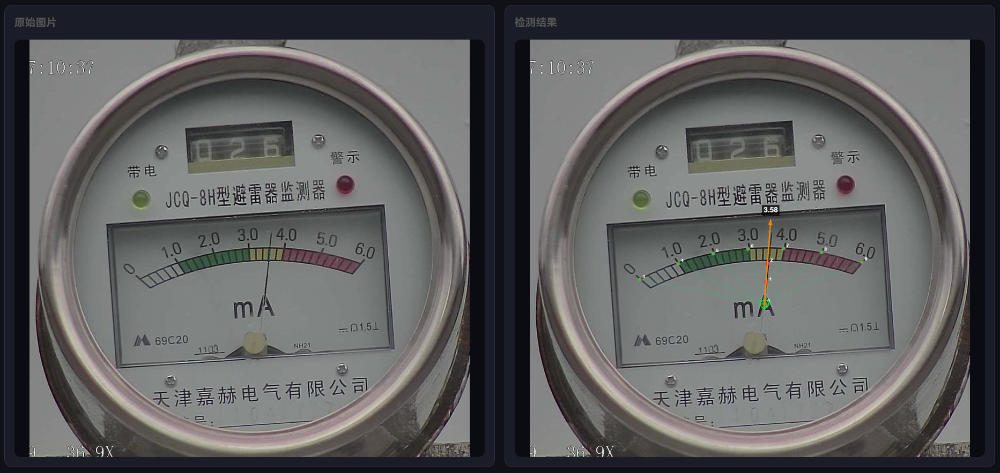

# meter-vision

<div align="right">
  <a href="README.zh-CN.md">中文</a> | <strong>English</strong>
</div>

**Pointer gauge reader powered by YOLO pose estimation.**

Automatically reads analog pointer gauges (pressure gauges, voltmeters, ammeters, etc.) from images or live video streams.

---

## Features

- Upload single or multiple images — results appear side-by-side with the original
- Live MJPEG video stream with real-time keypoint annotation and reading overlay
- Supports local USB/built-in cameras and RTSP IP cameras
- Single-command startup — backend serves the frontend at the same port
- Zero-dependency single-file web UI (no npm, no build step)

---

## How It Works

1. **YOLO Pose model** detects 10 keypoints per gauge:

   | kp_id | Role | Scale value |
   |---|---|---|
   | 0 | Pointer base / rotation pivot | — |
   | 1 | Pointer mid | — |
   | 2 | Pointer tip | — |
   | 3–9 | Dial scale marks | 0.0 → 6.0 |

2. **Perspective-robust algorithm** (`gauge_reader.py`):
   - Uses `kp_id 0` directly as the angular origin — avoids circle-fitting failure under perspective distortion
   - Computes pointer direction via confidence-weighted average of `kp_id 1/2`
   - Piecewise linear interpolation onto the scale arc
   - Returns reading value + out-of-range flag

3. **FastAPI backend** exposes:
   - `GET /` or `GET /ui` — web UI
   - `POST /detect` — image inference
   - `GET /video_feed?source=<cam>` — MJPEG stream
   - `GET /video_stop` — stop stream
   - `GET /health` — health check

---

## Project Structure

```
meter-vision/
├── backend/
│   ├── main.py            # FastAPI server
│   ├── gauge_reader.py    # Core reading algorithm
│   ├── requirements.txt
│   └── Dockerfile
├── frontend/
│   └── index.html         # Single-file web UI
├── models/
│   └── best.pt            # YOLO pose weights
├── docker-compose.yml
└── README.md
```

---

## Quick Start

### Option 1 — Run directly (recommended)

```bash
git clone https://github.com/your-username/meter-vision.git
cd meter-vision

# Install dependencies
pip install -r backend/requirements.txt

# Start (serves both API and UI on port 9090)
uvicorn backend.main:app --host 0.0.0.0 --port 9090
```

Open **http://localhost:9090** in your browser.

> **Note:** Run `uvicorn` from the `meter-vision/` root directory, not from inside `backend/`.

### Option 2 — Docker Compose

```bash
docker-compose up --build
```

- Web UI: http://localhost:8080
- API docs: http://localhost:9090/docs

---

## Usage

### Image Detection

1. Open http://localhost:9090
2. Drag & drop one or more gauge images onto the upload area
3. Detection runs automatically — results appear in the right panel with annotated overlay, reading value, and keypoint table
4. Hover over a thumbnail to delete it; click `+` to add more images

### Video Stream

1. Click the **视频流** tab
2. Enter camera source:
   - Local camera: `0` (built-in) or `1` (external USB)
   - IP camera: `rtsp://192.168.1.100:554/stream`
3. Click **开始推流** — the annotated live feed appears immediately

---

## API Reference

### `POST /detect`

**Request:** `multipart/form-data`, field `file`

**Response:**
```json
{
  "people": [
    {
      "person_id": 0,
      "keypoints": [{"kp_id": 0, "x": 613.2, "y": 976.8, "conf": 0.984}, "..."],
      "box": [483.6, 782.9, 1186.1, 972.5]
    }
  ],
  "reading": {
    "value": 3.45,
    "out_of_range": false,
    "confidence": 0.987,
    "pointer_angle_deg": -12.3,
    "pivot": [613.2, 976.8],
    "scale_points": [[1195.5, 863.8], "..."]
  }
}
```

### `GET /video_feed?source=<source>`

Returns an MJPEG stream (`multipart/x-mixed-replace`).

| source | Meaning |
|---|---|
| `0`, `1` | Local camera index |
| `rtsp://…` | RTSP IP camera URL |

### `GET /video_stop`

Stops the active stream. Returns `{"status": "stopped"}`.

---

## Training Your Own Model



Uses [Ultralytics YOLO](https://github.com/ultralytics/ultralytics) with a custom keypoint config.

1. Annotate images in COCO keypoint format (10 keypoints per gauge, order as above)
2. Train:
   ```bash
   yolo pose train data=your_data.yaml model=yolov8n-pose.pt epochs=200 imgsz=640
   ```
3. Replace `models/best.pt` with your trained weights

To adapt to a different scale range, edit `SCALE_MAP` in `backend/gauge_reader.py`.

---

## Requirements

- Python 3.10+
- PyTorch (CPU or CUDA)
- See `backend/requirements.txt`

---

## License

MIT License. See [LICENSE](LICENSE).

---

## Acknowledgements

- [Ultralytics YOLOv8](https://github.com/ultralytics/ultralytics)
- [FastAPI](https://fastapi.tiangolo.com/)

---

*If this project helps you, please give it a ⭐*
